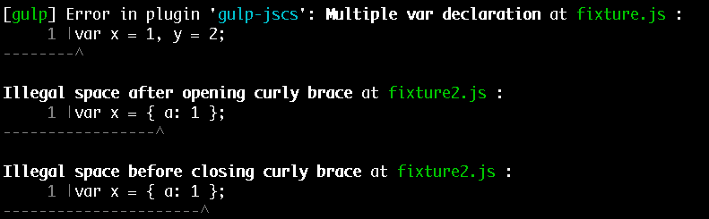

# gulp-jscs [](https://travis-ci.org/jscs-dev/gulp-jscs)

> Check JavaScript code style with [`jscs`](http://jscs.info)



*Issues with the output should be reported on the `jscs` [issue tracker](https://github.com/jscs-dev/node-jscs/issues).*


## Install

```
$ npm install --save-dev gulp-jscs
```


## Usage

### Reporting

```js
var gulp = require('gulp');
var jscs = require('gulp-jscs');

gulp.task('default', function () {
	return gulp.src('src/app.js')
		.pipe(jscs());
});
```

### Fixing & reporting

```js
var gulp = require('gulp');
var jscs = require('gulp-jscs');

gulp.task('default', function () {
	return gulp.src('src/app.js')
		.pipe(jscs({
			fix: true
		}))
		.pipe(gulp.dest('src'));
});
```


## Results

A `jscs` object will be attached to the file object which can be used for custom error reporting. An example with one error might look like this:

```js
{
	success: false,  // or true if no errors
	errorCount: 1,   // number of errors in the errors array
	errors: [{       // an array of jscs error objects
		filename: 'index.js',  // basename of the file
		rule: 'requireCamelCaseOrUpperCaseIdentifiers',  // the rule which triggered the error
		message: 'All identifiers must be camelCase or UPPER_CASE',  // error message
		line: 32,  // error line number
		column: 7  // error column
	}]
};
```


## API

### jscs([options])

#### options

Type: `object`

See the `jscs` [options](http://jscs.info/overview.html#options).

Alternatively you can set the `configPath` *(default: `'.jscsrc'`)* option to the path of a [.jscsrc](http://jscs.info/rules.html) file.

Set `esnext: true` if you want your code to be parsed as ES6 using the harmony
version of the esprima parser.

Set `fix: true` if you want jscs to attempt to auto-fix your files. Be sure to pipe to `gulp.dest` if you use this option.


## License

MIT © [Sindre Sorhus](http://sindresorhus.com)
